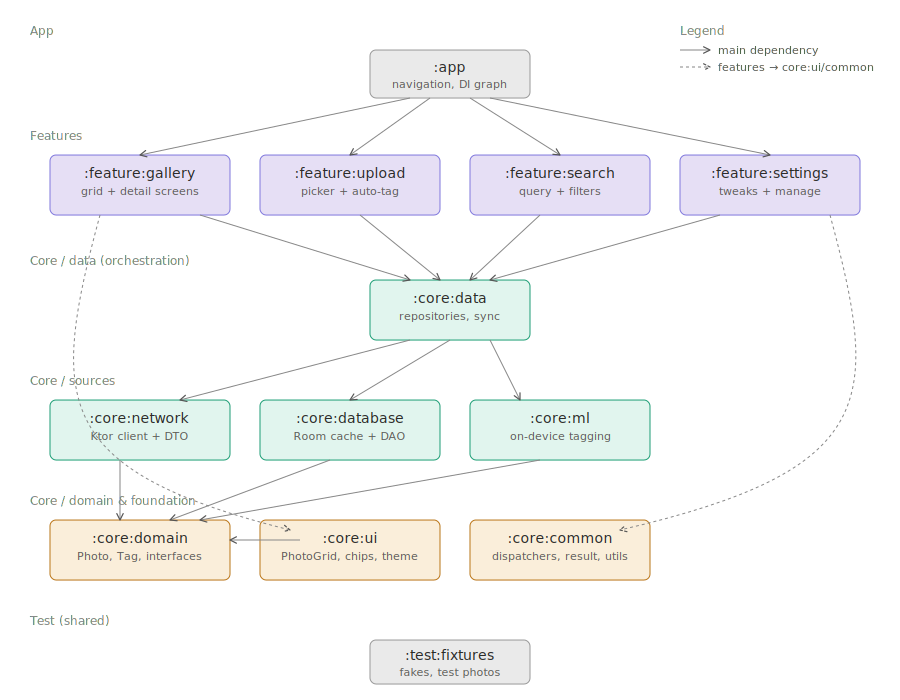

# PhotoVault

A self-hosted photo library with native Android client and Kotlin backend running on Raspberry Pi. Photos are auto-tagged on-device using on-device ML, synced to a local server, and searchable by tags, categories, and free-text queries.



## Project goals

This is a learning project with three concurrent goals, in rough priority order:

1. **Deepen architectural intuition** — practise modular Android design, draw clean module boundaries, and learn when to split vs. keep together.
2. **Learn REST API design end to end** — define a contract, implement it on both sides (Ktor server, Android client), and iterate on it.
3. **Build something useful for myself** — a private, self-hosted photo backup with smart search that runs on my own hardware.

Secondary learning goals that fall out naturally:

- On-device ML for photo tagging (MediaPipe / LiteRT).
- Kotlin backend with Ktor, running in Docker on a Raspberry Pi.
- Claude Code integration with Android Studio as part of the daily workflow.

## Non-goals

- Not a replacement for Google Photos or Immich — feature scope stays intentionally narrow.
- Not multi-user at first — single user, single server, trusted LAN.
- Not published on Google Play — portfolio and personal use only.

## Current phase

**Phase 0 — architecture planning.** No code yet. This README captures the decisions so far.

## Roadmap

| Phase | Focus | Status |
|---|---|---|
| 0 | Architecture planning, module boundaries, dependency rules | in progress |
| 1 | Project scaffold — Gradle modules, convention plugins, version catalog, empty feature screens | next |
| 2 | REST API contract — OpenAPI-ish spec, mock endpoints on n8n for offline dev | |
| 3 | Gallery feature — read-only grid backed by mock data, then by real Room cache | |
| 4 | Ktor backend — photo upload, storage, metadata DB on Raspberry Pi | |
| 5 | Upload feature — picker, progress, background work | |
| 6 | On-device ML — auto-tagging during upload | |
| 7 | Search feature — online query against server | |
| 8 | Settings, favorites, manage categories/tags | |

Phases are iterative, not sequential — Gallery will get revisited when Search lands, API contract will evolve as features go in.

## Tech stack

**Android client**

- Kotlin, Jetpack Compose, Material 3 with dynamic color
- minSdk 31 (Android 12), targetSdk 35 (Android 15)
- Dependency injection: Koin
- Networking: Ktor client + kotlinx.serialization
- Local cache: Room
- Background work: WorkManager
- On-device ML: MediaPipe Tasks (to be confirmed in phase 6)

**Backend**

- Kotlin, Ktor server
- Storage: local filesystem for photos, SQLite or Postgres for metadata (to be decided)
- Runs in Docker on Raspberry Pi
- Exposed over Tailscale for remote access
- During phase 2–3 the API is faked with n8n webhooks so client work is unblocked

**Tooling**

- Android Studio with Claude Code plugin
- Aider as a secondary AI workflow for TDD-heavy work
- Conventional commits
- Gradle version catalog + convention plugins

## Architecture

The app is split into modules along two axes:

- **Layer** — app, feature, data, sources, domain/foundation.
- **Responsibility** — each module owns one concern and nothing else.

### Module layout

```
:app                    — sticks everything together, owns navigation and DI graph

:feature:gallery        — grid of photos + photo detail screen
:feature:upload         — picker, auto-detection, upload progress
:feature:search         — free-text search, filters modal
:feature:settings       — tweaks (theme/accent/density/language) + manage categories/tags

:core:data              — PhotoRepository implementation, sync/cache orchestration
:core:network           — Ktor client, API contract, DTOs, network error handling
:core:database          — Room, entities, DAOs
:core:ml                — on-device tagging (MediaPipe / LiteRT wrapper)

:core:domain            — Photo, Tag, Category, SearchQuery, repository interfaces — pure Kotlin
:core:ui                — reusable composables (PhotoGrid, TagChip, LoadingState), theme, M3 tokens
:core:common            — dispatchers, Result, coroutine utilities, logging

:test:fixtures          — fake Photo data, in-memory repository, shared test doubles
```

### Dependency rules

The module graph is a DAG — directed, acyclic. Gradle rejects cycles at configure time, which is a free architectural check.

**The rules** (arrow = "depends on"):

- `:app` → all features, all core modules.
- `:feature:*` → `:core:data`, `:core:ui`, `:core:common`, `:core:domain`.
- `:feature:*` ✗ `:feature:*` — **features never depend on other features.** Communication goes through `:app` (navigation) or through shared state in `:core:data`.
- `:feature:*` ✗ `:core:network`, `:core:database`, `:core:ml` — features don't see data sources directly. They talk to repositories only.
- `:core:data` → `:core:domain`, `:core:network`, `:core:database`, `:core:ml`, `:core:common`. Implements domain interfaces using sources.
- `:core:network` ✗ `:core:database` — sources don't see each other. Each has its own DTO/Entity, mapping to domain happens in `:core:data`.
- `:core:ui` → `:core:domain`, `:core:common`. UI needs to know domain types (a `PhotoGrid` takes `List<Photo>`), but nothing below.
- `:core:domain` → nothing except Kotlin stdlib. It's the stable core, reusable anywhere — including potentially the backend.
- `:core:common` → nothing except Kotlin stdlib and coroutines.

### Why single source of truth matters here

`:feature:gallery` contains both the grid and the detail screen. They don't share `ViewModel` state directly — they both subscribe to the same `PhotoRepository` (from `:core:data`), which exposes `Flow<List<Photo>>` and `Flow<Photo>`. Toggling favorite in detail updates the repository, which re-emits, which updates gallery automatically. No cross-screen event bus, no lifted state, no duplication.

### Data strategy: hybrid

- **Gallery is offline-first** — Room is the source of truth, the network refreshes it in the background. Works on the plane.
- **Search is online-only** — queries go straight to the server and are not cached. Search results can reference photos the user doesn't have locally.

This split matches how the data actually behaves: gallery is a stable set re-read many times, search is ephemeral and broader than the local cache.

## Setup

_To be filled in during phase 1._

## License

TBD (this is a personal/learning project; license will be added when it matters).